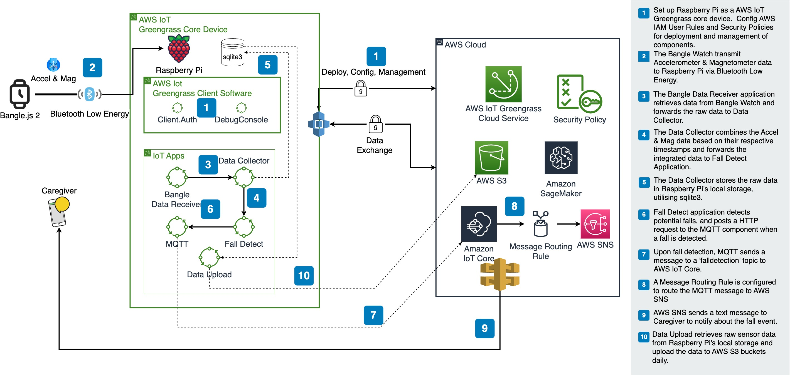
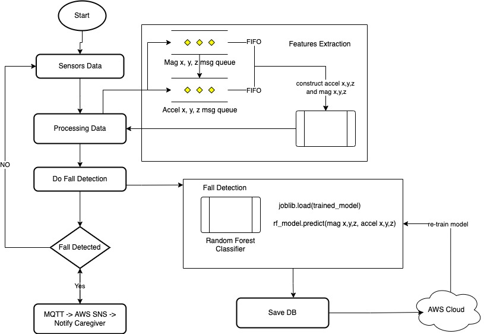

# fall-detection-iot-solution

ver 0.0.1 (by Adam, ChatGPT, Luohua, Shiyu)

All artifacts can be found from https://drive.google.com/drive/u/1/folders/1IZYhe6mn8hMXtcixAMq8bm1oOd1fXOrj

# How it works

## Solution Diagram at a glance



## Data Flow



## Data from bangle watch


Once the app is launched by user, the following data will be send out through Web Bluetooth

- Time - Current time (milliseconds since 1970)

- [Accelerometer data](http://www.espruino.com/ReferenceBANGLEJS2#l_Bangle_accel)

    - `x` is X axis (left-right) in `g`
    - `y` is Y axis (up-down) in `g`
    - `z` is Z axis (in-out) in `g`

- [Magnetometer readings](http://www.espruino.com/ReferenceBANGLEJS2#l_Bangle_mag)

    - `x/y/z` raw x,y,z magnetometer readings

## Fall Detection Algo Design Process

We follow the Design Process for Human-Centric Systems to design our fall detection algo.
See [Design Process](doc/fall-detection-design-process.pdf)

## The fall detection Algo

The data we reply on to do fall detections, are from

* 3 Axis Accelerometer (Kionix KX023)
* 3 Axis Magnetometer
  and the model is trained with data set
  from https://archive.ics.uci.edu/ml/datasets/Simulated+Falls+and+Daily+Living+Activities+Data+Set#

The classifier accuracy comparison:

| Classifier                               | Training Accuracy |
| ---------------------------------------  | ----------------- |
| Random_Forest_classifier.py              | 0.999             |
| knn_classifier.py                        | 0.979             |
| Artificial_Neural_Networks_classifier.py | 0.934             |
| LSM_classifier.py                        | 0.635             |
| bayesian_decision_making_classifier.py   | 0.646             |

We decided to use Random Forest Classifier to do fall detection.

# Fall Detection IoT Solution - v2

In version 1 of the solution, we used the MQTT Broker provided by AWS IoT Core to send MQTT messages from RPi to AWS IoT Core. We configured a Message Routing Rule in AWS IoT Core to send a text message to a specified phone number via AWS SNS when a message with the topic `falldetection` was received.

In the solution for version 2, we removed the dependency on AWS MQTT Broker and AWS SNS.

1. We used the open-source MQTT Broker, [Eclipse Mosquitto](https://mosquitto.org/). We installed and configured the Mosquitto service on an RPi 4 and subscribed to the topic `falldetection` on a laptop.
2. We replaced AWS SNS with [smtplib - SMTP protocol client](https://docs.python.org/3/library/smtplib.html) to send notifications to the caregiver.

# How to make it work for you

## Setup the project

1. Follow [this instruction](doc/aws-greengrass-setup.md) to setup AWS Greengrass on Raspberry Pi
2. Follow [this instruction](bangle-app/README.md) to setup app on Bangle watch
2. Follow [this instruction](doc/mqtt-and-email-config.md) to setup MQTT Broker and Email

## Run the project

After installing and configuring AWS Greengrass on RPi

1. Start the local debug console for Greengrass on RPi.

   1. Open a terminal on RPi and enter the following command to obtain the login password for the debug console:

      ```
      sudo /greengrass/v2/bin/greengrass-cli get-debug-password
      ```

   2. Open a browser and visit `https://localhost:1441/`. Enter the username and password obtained in the previous step when prompted.

   3. Ensure that all components are in the "Running" state.

2. Download the `mqtt_sub.py` and `notify.py` files from the `app` directory of the project to your laptop and place them in the same directory.

3. Refer to [this instruction](doc/mqtt-and-email-config.md) to ensure that the email configuration in the `.env` file is set up correctly. Make sure the `.env` file is stored in the root directory of the folder created in the previous step.

4. Ensure that both the laptop and RPi are connected to the same network. Modify the `broker_address` in the `mqtt_sub.py` program to the IP address of RPi.

5. Run the `mqtt_sub.py` program.

6. Launch the FallDetect App on the Bangle watch.

# Q & A

1. How to make sure that all components are running properly?

   All GreenGrass logs are stored in the `/greengrass/v2/logs/` directory.

   1. Open the terminal on RPi and acquire root privileges with `sudo su`.
   2. Navigate to the log directory: `/greengrass/v2/logs/`.
   3. View the logs: `tail -f com.example.xxxxxx.log`.

2. Components deployment show error in the debug console

   1. Try stopping the component directly on the debug console page and then restart it.

   2. Try to reinstall the component directly on the debug console page.

   3. Try deleting the component and then redeploy it.

      ```shell
      ### Create a deployment:
      sudo /greengrass/v2/bin/greengrass-cli deployment create --recipeDir ~/Desktop/fall-detection-iot-solution/rpi-aws-components/components/recipe/ --artifactDir ~/Desktop/fall-detection-iot-solution/rpi-aws-components/components/artifacts/ --merge "com.example.bangledatareceiver=1.0.2"
      
      ### Remove a component:
      sudo /greengrass/v2/bin/greengrass-cli deployment create --remove "com.example.bangledatareceiver"
      ```

      Note: Remember to modify the recipeDir, artifactDir, component name, and version number in the commands with the correct values.

# When all else fails

[Create an Issue](https://github.com/NUS-ArchSS/fall-detection-iot-solution/issues/new) 

or

Contact someone on the team

- luohua.huang@u.nus.edu

- shiyu.wang@u.nus.edu

- adamwwsia@u.nus.edu

